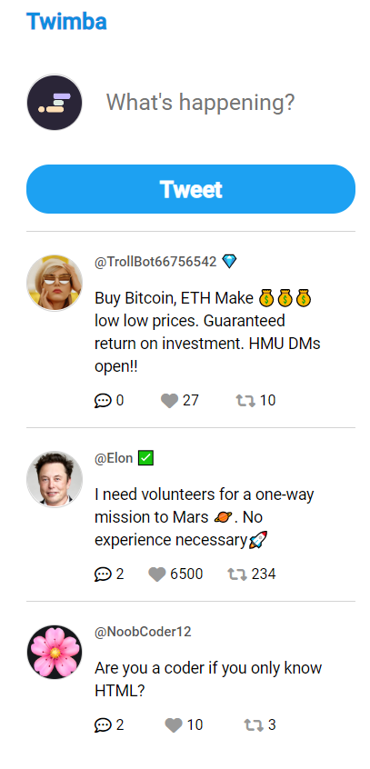

## Table of contents

- [Overview](#overview)
  - [The challenge](#the-challenge)
  - [Screenshot](#screenshot)
  - [Links](#links)
  - [How to install](#how-to-install)
- [My process](#my-process)
  - [What I learned](#What-I-learned)

## Overview

### The challenge

Twimba: Twitter Clone

### Screenshot

### Links

- Solution URL: [GitHub](https://github.com/memo-ibrahim-alean/Twimba)
- Live Site URL: [Live](https://memo-ibrahim-alean.github.io/Twimba/)

### How to install

- Clone Repo or Download Zip
- That's it! 🎉

## My process

### What I learned

- textarea
- .forEach()
- data attributes
- conditionally render styles
- NOT operator (!)
- CDNs
  - add icons
  - generate UUIDs
